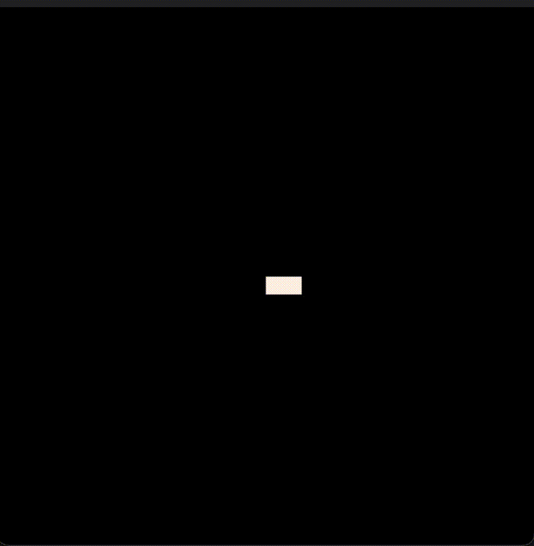
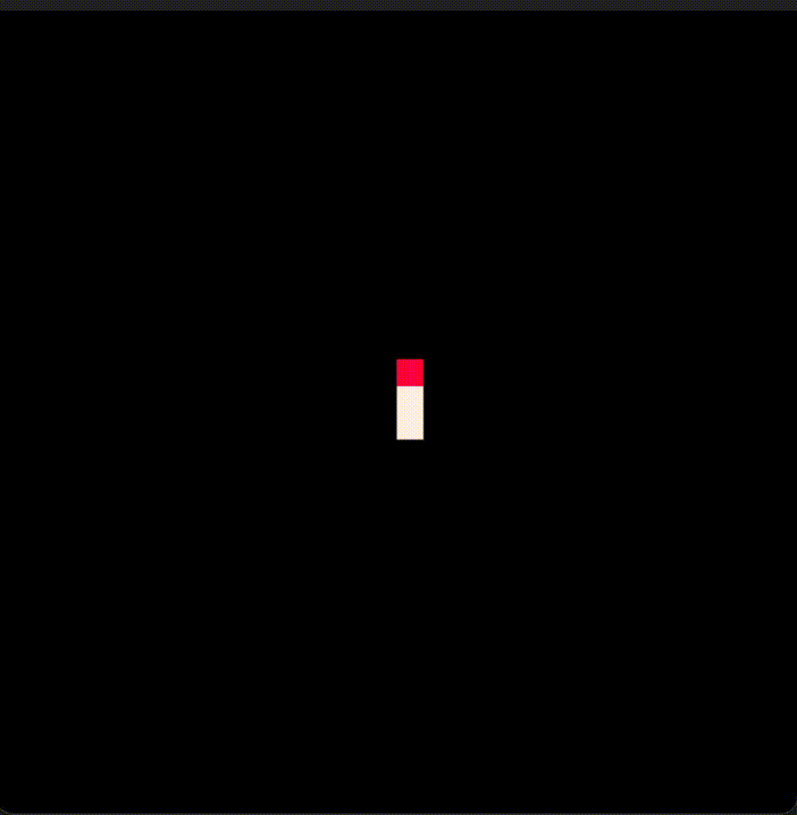

# Cherry
This is my own implementation of [MarkovJunior](https://github.com/mxgmn/MarkovJunior) (for learning purposes), which I find awesome.

# Build
Inside the `build` directory, run `cmake ..` then `make`.

# Usage
Still inside the `build` directory, run `./Cherry MODELNAME`, for example `./Cherry Tiles`.

# Examples

 
(WB = WW) | (RBB=WWR) | LoopErasedWalk

